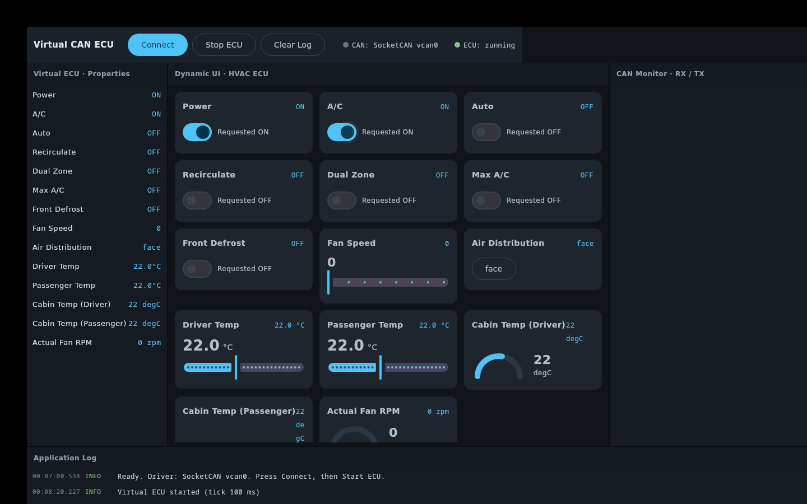

# Virtual CAN ECU Simulator

A desktop app that acts as a **Virtual ECU on a CAN bus**. It receives request
frames (e.g. from an IVI head unit), decodes them with a DBC, runs ECU logic,
updates a dynamically generated UI, and transmits status frames back.

The first ECU implemented is **HVAC**, but nothing about the app is
HVAC-specific: the ECU is defined entirely by a **DBC** (message/signal layout)
plus a **YAML** (widgets, rules, periodic TX). Point it at a different pair of
files and it becomes a Cluster / BCM / Gateway / Seats simulator with no code
change.

> **Status:** MVP complete and verified — native JNI bridge, headless pipeline
> self-test (14/14), and the Compose UI all run. The screenshot below is the
> live app with the ECU running and Power/A/C toggled on.



## Architecture

```
Compose UI  (ui/)                     dynamic widgets, CAN monitor, log
    │  observes StateFlow
ViewModel  (viewmodel/)               wiring + lifecycle (connect / start ECU)
    │
Property Manager  (core/property/)    YAML widget specs × DBC metadata → Property
    │
Virtual ECU Engine  (core/ecu/)       request → rules → feedback, signal state
    │
Rule Engine  (core/rule/)             mirror / scale / ramp rules from YAML
    │
DBC Service  (dbc/)  ─── JNI ───▶ dbcppp     encode / decode / schema
    │
CAN Driver  (can/)   ─── JNI ───▶ SocketCAN  (Linux)   |   PCAN (Windows, stub)
```

Each layer is independent; only `DbcService` knows dbcppp, only the drivers know
the transport, only the UI knows Compose.

## Layout

| Path | What |
|------|------|
| `config/hvac.dbc` | DBC database — HVAC modelled on the AOSP VHAL HVAC properties |
| `config/hvac.yml` | UI widgets, defaults, rules, periodic TX — all by signal name |
| `native/` | `libvecunative.so`: JNI bridge for dbcppp + SocketCAN (CMake) |
| `native/prebuilt/` | vendored dbcppp: shared headers + per-arch `libdbcppp.so` (x86_64 + aarch64) |
| `src/main/kotlin/com/vecu/` | the Kotlin/Compose application |
| `scripts/` | `setup_vcan.sh`, `ivi_demo.sh` |

```
src/main/kotlin/com/vecu/
├── Main.kt                     application entry (window)
├── SelfTest.kt                 headless pipeline check (./gradlew selfTest)
├── config/                     AppConfig, NativeLoader
├── dbc/                        DbcNative (JNI), DbcSchema, DbcService  ── dbcppp
├── can/                        CanDriver, SocketCanDriver, PcanDriver, SocketCanNative
├── core/
│   ├── config/                 SimConfig (YAML: widgets, rules, tx, defaults)
│   ├── property/               Property, PropertyManager, WidgetType
│   ├── rule/                   RuleEngine (mirror / scale / ramp)
│   ├── ecu/                    EcuState, VirtualEcu
│   └── scheduler/              TxScheduler (periodic TX)
├── viewmodel/                  SimulatorViewModel, UiState
└── ui/                         App, Toolbar, PropertyPanel, DynamicUi, CanMonitor, LogPanel, Theme
```

## Prerequisites (already provisioned on this machine)

- **JDK 17+** (a full JDK — the native bridge needs `javac` + `jni.h`). Gradle
  uses `JAVA_HOME` / the `java` on `PATH`; pin a specific JDK via
  `org.gradle.java.home` in `gradle.properties` if you have several. Kotlin
  targets JVM 11 bytecode for broad compatibility.
- **dbcppp** is vendored in-tree at `native/prebuilt/` (shared headers + a
  per-arch prebuilt `libdbcppp.so.3.8.0` for **linux-x86_64** and
  **linux-aarch64**/Pi) — no external dependency. CMake picks the `.so` by target
  arch; the JNI lib is linked with an `$ORIGIN` rpath and the `.so` is copied
  next to it, so it loads with no `LD_LIBRARY_PATH`. Override with
  `-DDBCPPP_PREFIX=...`; see `native/prebuilt/README.md` for provenance and the
  aarch64 cross-build script.
- A C++17 toolchain (`g++`, `cmake`) for the JNI bridge.
- `can-utils` (`cansend` / `candump`) for the wire test.

## Build & run

```bash
./gradlew run          # builds the native bridge, compiles, launches the UI
```

On startup it loads the DBC + YAML, builds the property model, generates the UI,
and is ready. Use the toolbar: **Connect** (open CAN) → **Start ECU** (run rules
+ periodic TX).

### Headless self-test (no CAN, no display)

```bash
./gradlew selfTest
```

Exercises the whole pipeline — DBC load, property build, rule engine
(mirror/gate/scale/ramp), encode/decode round-trip, power-off gating — and
prints PASS/FAIL per check.

## Live bus test

```bash
sudo scripts/setup_vcan.sh     # create + bring up vcan0 (needs root once)
./gradlew run                  # then click Connect, then Start ECU
candump vcan0                  # optional: watch the bus in another terminal
scripts/ivi_demo.sh            # sends HvacControl/HvacTempControl requests
```

The simulator's widgets track each incoming command, and it transmits
`HvacStatus` (0x500) and `HvacTemperatures` (0x501) back to the bus at the
periods set under `tx:` in `config/hvac.yml`.

## The YAML contract

```yaml
ui:
  - id: fanSpeed
    title: Fan Speed
    widget: slider          # switch | slider | temperature | dropdown | gauge | label | button
    min: 0
    max: 7
    request: HvacFanSpeedReq   # signal the control writes
    feedback: HvacFanSpeed     # signal the control reads back

rules:
  - { type: mirror, from: HvacFanSpeedReq, to: HvacFanSpeed, gatedBy: HvacPowerOn }
  - { type: scale,  from: HvacFanSpeed, to: HvacActualFanRpm, factor: 350 }
  - { type: ramp,   to: HvacTempCurrentDriver, toward: HvacTempSetDriver, rate: 0.2 }

tx:
  - { message: HvacStatus, period_ms: 100 }     # cyclic
  - { message: GearStatus, on_change: true }     # event-triggered (gear, indicators…)
  - { message: DoorStatus, period_ms: 1000, on_change: true }  # both
```

- **mirror** `to = from` (0 when `gatedBy` is off; skipped unless `onlyWhen` on)
- **scale** `to = from * factor`
- **ramp** `to` moves toward `toward` by `rate` each tick

### Transmission types

Each `tx:` entry is one of the standard CAN transmission types:

- **cyclic** — `period_ms: N` sends every N ms (e.g. `HvacStatus`).
- **on-change** — `on_change: true` sends only when the message's encoded
  content changes (e.g. `GEAR_SELECTION`, turn indicators, button presses — not
  periodic). Detected each rule tick, so a UI/CAN-driven change reaches the bus
  within one tick.
- **both** — set `period_ms` *and* `on_change` for a cyclic message that also
  pushes immediately on change.

On-change messages are (re)sent once as a baseline right after **Connect**.

## Verification

Three levels, all passing:

1. **Native contract** — the JNI bridge loads the DBC, emits the schema, and
   round-trips an encode → decode (`HvacStatus` with fan=5, RPM=1500).
2. **`./gradlew selfTest`** — 14/14 checks: property build, dropdown enums from
   the DBC, mirror/scale/ramp rules, cabin-temp ramp to setpoint, encode/decode
   round-trip, and power-off gating.
3. **GUI** — launches and renders all panels; driving it live (Start ECU, toggle
   Power/A/C) shows the request → rule engine → feedback loop update the widgets.

The only path not exercised end-to-end in the build environment is the live
SocketCAN wire I/O, because creating `vcan0` needs root — run the
[Live bus test](#live-bus-test) to cover it.

## Notes / limitations (MVP)

- SocketCAN only on Linux; the Windows PCAN driver is a stub behind the same
  `CanDriver` interface.
- Configuration is hardcoded in `config/AppConfig.kt` (no file dialogs / project
  management) — by design for the MVP.
