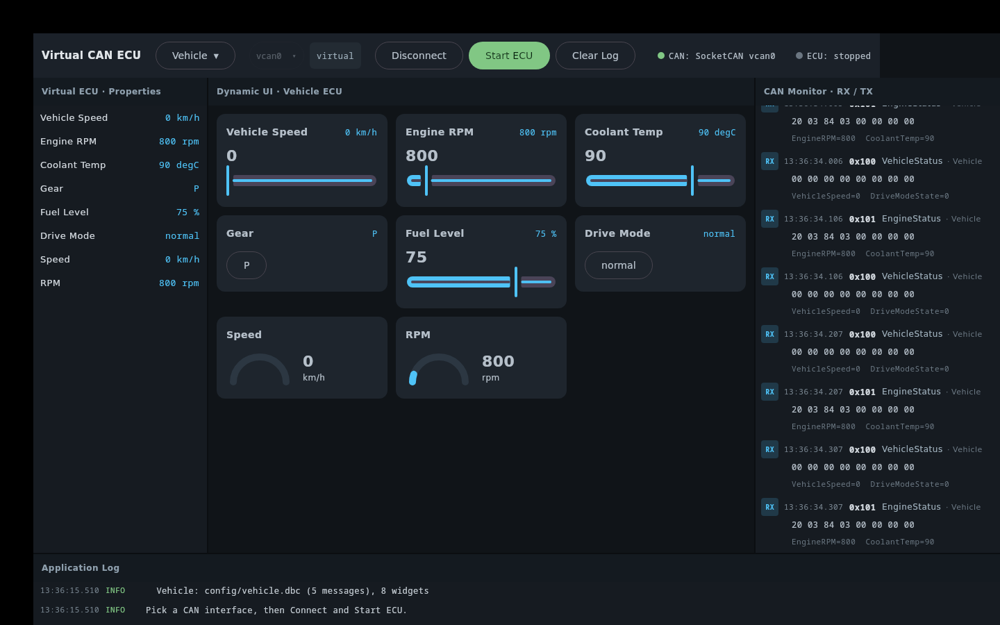
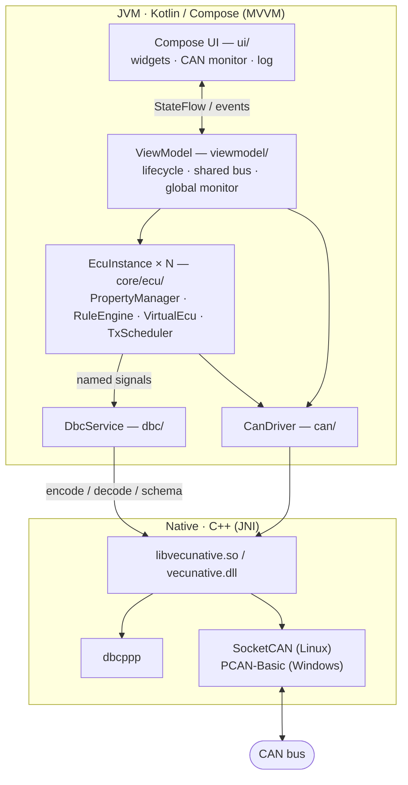
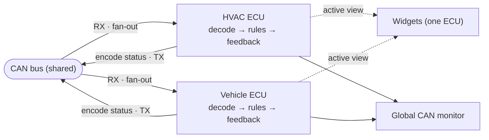

# Virtual CAN ECU Simulator

A desktop app that acts as a **Virtual ECU on a CAN bus**. It receives request
frames (e.g. from an IVI head unit), decodes them with a DBC, runs ECU logic,
updates a dynamically generated UI, and transmits status frames back.

An ECU is defined entirely by a **DBC** (message/signal layout) plus a **YAML**
(widgets, rules, periodic TX) — no code is ECU-specific. The app ships two
**profiles**, **HVAC** and **Vehicle**. **All profiles run concurrently** on one
shared bus (each decodes only its own DBC's messages and transmits only its own
status); the toolbar dropdown just selects which one's UI you *view* — switching
is instant and stops nothing. The **CAN monitor is global** (whole bus, each row
tagged with its ECU). Adding a Cluster / BCM / Gateway / Seats ECU is just
another `(dbc, yaml)` pair in `AppConfig.PROFILES`.

> **Status:** working and verified end-to-end — native JNI bridge, headless
> self-test (20 checks), the Compose UI, and **live SocketCAN on `vcan0`** (both
> ECUs on one bus). Runs on Linux (SocketCAN) and Windows (PCAN-USB).


*Viewing the **HVAC** ECU while the Vehicle ECU runs concurrently — its live
telemetry is decoded and tagged in the global CAN monitor (right).*



*Switching the view to the **Vehicle** ECU (nothing stops): speed / RPM / coolant
/ fuel, a gear dropdown (P/R/N/D/S/L) and drive-mode selector — the same monitor,
the other profile.*

## Architecture

Layered and independent: only `DbcService` knows dbcppp, only the drivers know
the transport, only the UI knows Compose. One native library (`libvecunative.so`
/ `vecunative.dll`) bridges both dbcppp and the CAN transport over JNI.



**Run-all, view-one.** Every profile runs as its own `EcuInstance` on one shared
bus. RX fans out to all instances (each decodes only its own DBC); every instance
transmits its own status. The toolbar picks which one's widgets you see; the CAN
monitor shows the whole bus.



## Layout

| Path | What |
|------|------|
| `config/hvac.dbc` + `hvac.yml` | HVAC ECU profile (modelled on the AOSP VHAL HVAC properties) |
| `config/vehicle.dbc` + `vehicle.yml` | Common Vehicle ECU profile (speed, gear, drive mode, steering) |
| `config/powertrain.dbc` + `powertrain.yml` | Powertrain (ICE) ECU profile (engine RPM, coolant, fuel) — absent on a battery-electric vehicle |
| `config/battery.dbc` + `battery.yml` | HV battery / BMS profile (SoC, pack V/I, temps, energy) — any hybrid or EV |
| `config/motor.dbc` + `motor.yml` | E-motor / inverter profile (speed, torque, signed power, thermals) — any hybrid or EV |
| `config/charging.dbc` + `charging.yml` | On-board charger + charge port — plug-in vehicles only; receives ChargingControl |
| `native/` | JNI bridge for dbcppp + SocketCAN/PCAN (CMake, OS-conditional) |
| `native/prebuilt/` | vendored dbcppp: shared headers + per-platform lib (linux-x86_64, linux-aarch64, windows-x86_64) |
| `src/main/kotlin/com/vecu/` | the Kotlin/Compose application |
| `scripts/` | `setup_vcan.sh`, `ivi_demo.sh` |

```
src/main/kotlin/com/vecu/
├── Main.kt                     application entry (window)
├── SelfTest.kt                 headless pipeline check (./gradlew selfTest)
├── config/                     AppConfig, EcuProfile, NativeLoader
├── dbc/                        DbcNative (JNI), DbcSchema, DbcService  ── dbcppp
├── can/                        CanDriver, SocketCanDriver/Native, PcanDriver/Native, CanFrame
├── core/
│   ├── config/                 SimConfig (YAML: widgets, rules, tx, defaults)
│   ├── property/               Property, PropertyManager, WidgetType
│   ├── rule/                   RuleEngine (mirror / scale / ramp / counter)
│   ├── ecu/                    EcuInstance (per-profile runtime), VirtualEcu, EcuState
│   └── scheduler/              TxScheduler (cyclic / on-change TX)
├── viewmodel/                  SimulatorViewModel, UiState
└── ui/                         App, Toolbar, PropertyPanel, DynamicUi, CanMonitor, LogPanel, Theme
```

## Prerequisites

- **JDK 17+** (a full JDK — the native bridge needs `javac` + `jni.h`). Gradle
  uses `JAVA_HOME` / the `java` on `PATH`; pin a specific JDK via
  `org.gradle.java.home` in `gradle.properties` if you have several. Kotlin
  targets JVM 11 bytecode for broad compatibility.
- **dbcppp** is vendored in-tree at `native/prebuilt/` (shared headers + a
  per-arch prebuilt `libdbcppp.so.3.8.0` for **linux-x86_64** and
  **linux-aarch64**/Pi) — no external dependency. CMake picks the `.so` by target
  arch; the JNI lib is linked with an `$ORIGIN` rpath and the `.so` is copied
  next to it, so it loads with no `LD_LIBRARY_PATH`. Override with
  `-DDBCPPP_PREFIX=...`; see `native/prebuilt/README.md` for provenance and the
  aarch64 cross-build script.
- A C++17 toolchain (`g++`, `cmake`) for the JNI bridge.
- `can-utils` (`cansend` / `candump`) for the wire test.

## Build & run

```bash
./gradlew run          # builds the native bridge, compiles, launches the UI
```

On startup it loads the DBC + YAML, builds the property model, generates the UI,
and is ready. In the toolbar, pick the **CAN interface** + **bitrate** (a shared
bus for all ECUs; detected SocketCAN devices on Linux, PCAN channels on Windows),
then **Connect** → **Start ECU** (run rules + periodic TX).

### Headless self-test (no CAN, no display)

```bash
./gradlew selfTest
```

Exercises the whole pipeline — DBC load, property build, rule engine
(mirror/gate/scale/ramp/counter), encode/decode round-trip, power-off gating —
and prints PASS/FAIL per check.

## Live bus test

```bash
sudo scripts/setup_vcan.sh     # create + bring up vcan0 (needs root once)
./gradlew run                  # then click Connect, then Start ECU
candump vcan0                  # optional: watch the bus in another terminal
scripts/ivi_demo.sh            # sends HvacControl/HvacTempControl requests
```

The simulator's widgets track each incoming command, and it transmits
`HvacStatus` (0x500) and `HvacTemperatures` (0x501) back to the bus at the
periods set under `tx:` in `config/hvac.yml`.

## YAML schema

A profile's `*.yml` defines its UI, behaviour and transmission — entirely by
**signal / message name** (never CAN ids or bit positions; those live in the DBC).
The CAN interface + bitrate are chosen in the toolbar, not here.

```yaml
ecu:
  name: HVAC                     # ECU display name

defaults:                        # optional — initial signal values (physical units)
  HvacTempSetDriver: 22.0

ui:                              # widgets, rendered in this order
  - id: fanSpeed                 # unique id (required)
    title: Fan Speed             # label (optional; defaults to id)
    widget: slider               # switch|slider|temperature|dropdown|gauge|label|button|momentary
    request: HvacFanSpeedReq     # optional — signal the control writes
    feedback: HvacFanSpeed       # optional — signal it displays / reads back
    min: 0                       # optional — else the DBC signal's min
    max: 7                       # optional — else the DBC signal's max
    step: 1                      # optional — slider / temperature increment

rules:                           # ECU behaviour, applied in order every tick
  - { type: mirror, from: HvacFanSpeedReq, to: HvacFanSpeed, gatedBy: HvacPowerOn }
  - { type: scale,  from: HvacFanSpeed, to: HvacActualFanRpm, factor: 350 }
  - { type: ramp,   to: HvacTempCurrentDriver, toward: HvacTempSetDriver, rate: 0.2 }

tx:                              # status transmission
  - { message: HvacStatus, period_ms: 100 }
  - { message: GearStatus, on_change: true }
  - { message: DoorStatus, period_ms: 1000, on_change: true }
```

### Widgets (`ui:`)

| widget | control writes | displays | notes |
|--------|----------------|----------|-------|
| `switch` | `request` 0/1 | `feedback` on/off | |
| `slider` | `request` | value | honours `min`/`max`/`step` |
| `temperature` | `request` | value | like slider, °C-formatted |
| `dropdown` | `request` | enum label | options come from the DBC `VAL_` table |
| `gauge` | — (read-only) | `feedback` | arc display |
| `label` | — (read-only) | `feedback` | text |
| `button` | `request` = 1 | — | one-shot: writes 1 and nothing else |
| `momentary` | fires an **event** per gesture step | — | a key, not a value — see below |

#### `momentary` — keys that report gestures

Every widget above writes a signal that then sits there until something changes
it. A button press is not like that: it happens, and then it is over. So
`momentary` does not write a value at all — it fires a **message**, once per
gesture step:

```
PRESSED  ──(long_press_ms)──►  LONG_PRESSED  ──(repeat_ms)──►  REPEAT … ──►  RELEASED
```

```yaml
gesture:                         # profile-level; defaults 600 / 150
  long_press_ms: 600
  repeat_ms: 150

ui:
  - id: volUp
    title: Volume +
    widget: momentary
    event: SteeringWheelEvent    # message fired once per gesture step
    phase: ButtonAction          # signal carrying PRESSED/LONG_PRESSED/REPEAT/RELEASED
    set:                         # signals identifying this key
      ButtonCode: VOLUME_UP      # a DBC VAL_ label, or a plain number
      ButtonSource: RIGHT_STEERING
```

- `set:` values may be written as **DBC `VAL_` labels**, resolved at load, so the
  YAML never repeats a number the DBC already owns and a typo fails at load
  instead of putting a wrong code on the bus. The four `phase` values are
  resolved the same way, by name.
- Its message is **absent from `tx:`**. `on_change` would not work: change
  detection runs on the 100 ms engine tick, so a click that pressed and released
  inside one tick would be seen only as its release, and two identical `REPEAT`
  steps would collapse into one. An event has to be sent when it occurs.
- The alive `counter` rule still advances once per transmit — which here means
  once per gesture step, exactly what it should count.
- `gesture:` timing is a **simulator** setting, not a CAN contract. A real switch
  module has its own thresholds, and no consumer may infer a long press from
  timing — that is what the `LONG_PRESSED` action on the wire is for.

See `config/swc.yml` (the Virtual SWC ECU) for the whole thing.

`request` is what the control writes (a command, as if from the IVI); `feedback`
is what it reads back (the ECU's reported state). For pure telemetry the two are
the **same** signal (`request == feedback`), so the control both sets and shows it.
Ranges/units/enum options come from the DBC unless the YAML overrides them.

### Rules (`rules:`)

Applied in order, every tick, over the ECU's signal state.

| type | effect | fields |
|------|--------|--------|
| `mirror` | `to = from` | `from`, `to`, `gatedBy?`, `onlyWhen?` |
| `scale` | `to = from × factor` | `from`, `to`, `factor`, `gatedBy?` |
| `ramp` | `to` moves toward `toward` by `rate` per tick | `to`, `toward`, `rate` |
| `counter` | `to` increments by `rate` (default 1) per **actual transmit** of its message, wraps to `0` at `wrap` | `to`, `wrap`, `rate?` |

- `gatedBy: SIG` — forces the result to `0` when `SIG` is off (e.g. everything off when power is off).
- `onlyWhen: SIG` — skips the rule unless `SIG` is on (e.g. passenger temp follows driver only in dual mode).
- `counter` is for rolling alive counters (e.g. `wrap: 16` → cycles 0..15) so receivers can detect frame loss.
  It advances once per actual transmit (cyclic or on-change), never per tick — a real alive counter must go
  "+1 per frame", not "+1 per tick", or a receiver would see phantom frame loss on every healthy send.

### Transmission (`tx:`)

The standard CAN transmission types:

| form | behaviour |
|------|-----------|
| `period_ms: N` | **cyclic** — send every N ms (e.g. `HvacStatus`) |
| `on_change: true` | **on-change** — send only when the message's encoded content changes (gear, indicators, button presses); detected each tick |
| both | **cyclic + on-change** — a heartbeat that also pushes immediately on change |

On-change messages are (re)sent once as a baseline right after **Connect**.

## Verification

All passing:

- **`./gradlew selfTest`** (20 checks) — every profile loads; multi-ECU routing
  (HVAC handles `HvacControl`, Vehicle ignores it); property build; dropdown
  enums from the DBC; mirror/scale/ramp rules; ramp-to-setpoint; encode/decode
  round-trip; power-off gating.
- **GUI** — all panels render; driving it live (Start ECU, toggle switches,
  switch profiles) works.
- **Live SocketCAN** (`vcan0`) — injected an `HvacControl` request and observed
  the HVAC ECU transmit `HvacStatus` back (~71 ms later) while the Vehicle ECU
  transmitted its telemetry concurrently, all decoded in the global monitor.

On **Windows**, the DLLs are cross-built and validated as PE (arch + JNI exports);
the on-device PCAN run is done on the Windows machine.

## Running on Windows (PCAN-USB)

The UI/logic is pure JVM and runs on Windows unchanged; the CAN transport uses
**PEAK PCAN-Basic** instead of SocketCAN. The whole native bridge is shipped
prebuilt in `native/prebuilt/windows-x86_64/` (cross-built with llvm-mingw), so
you only need a **JDK 17+** to run — no C++ toolchain.

### What you install vs. what ships

`PCANBasic.dll` is **not** part of this app and is deliberately not bundled: it
is the user-mode half of a kernel driver pair, so shipping a copy that does not
match the installed driver invites subtle breakage, and it is PEAK's
redistributable rather than something this (MIT-track) repo can carry. It is
loaded by name at runtime (`LoadLibraryA("PCANBasic.dll")`), which is also why
the build needs no PEAK SDK.

| Ships with vecu-sim | You install |
|---|---|
| `vecunative.dll` (this app's JNI bridge) | PEAK **device driver** (so Windows enumerates the adapter) |
| `libdbcppp.dll` + `libc++.dll`, `libunwind.dll` | **`PCANBasic.dll`** (the PCAN-Basic API) |
| | the **PCAN-USB adapter** itself |

**PCAN-View is not required.** It is another client of the same DLL, not a
dependency — handy as a second pair of eyes on the bus, nothing more. The
confusion is understandable: PEAK's installer bundles the driver, the DLL and
PCAN-View together, so they arrive as one thing.

### Setup

1. **Install the PEAK driver package** — "PEAK-System Device Driver Setup",
   from the Downloads > Drivers section of <https://www.peak-system.com>.
   Accept the default components: the PCAN-Basic API is one of them, and that
   is what puts `PCANBasic.dll` on the system. PCAN-View is optional (above).

2. **Plug in the PCAN-USB** and confirm Windows sees it — Device Manager should
   list it with no warning triangle. If it does not, the driver did not install;
   nothing below will work.

3. **Check `PCANBasic.dll` is there, and is the 64-bit one.** This app's JNI
   bridge is x86_64, so it must be run by a **64-bit JDK** and will load the
   64-bit DLL. On 64-bit Windows the two builds live in confusingly named
   directories:

   | Path | Build |
   |---|---|
   | `C:\Windows\System32\PCANBasic.dll` | **64-bit** ← the one this app uses |
   | `C:\Windows\SysWOW64\PCANBasic.dll` | 32-bit |

   ```powershell
   Test-Path C:\Windows\System32\PCANBasic.dll   # must be True
   ```

   If it is missing, install the **PCAN-Basic API** package separately (same
   downloads page) and copy `x64\PCANBasic.dll` into `System32`, or put it
   beside the app — any directory on the DLL search path works.

4. **Run the app**; in the toolbar pick the channel (e.g. `PCAN_USBBUS1`) and
   bitrate (e.g. `500K`) from the CAN interface / bitrate dropdowns.

5. **Connect** → **Start ECU**. Inject requests / watch status with PCAN-View or
   a second CAN node. The PEAK driver allows several clients on one channel, so
   PCAN-View can sit on `PCAN_USBBUS1` alongside this app — but the **first**
   client fixes the bitrate, so set the same value in both or the second one
   fails to initialise.

### When it does not connect

The two failure modes are deliberately distinguishable. Both arrive as
`cannot open PCAN_USBBUS1: <detail>. Is the PEAK driver installed and the
PCAN-USB plugged in?` — the `<detail>` is what tells them apart:

| `<detail>` | Meaning | Fix |
|---|---|---|
| `PCANBasic.dll not loaded` | the DLL was never found on the search path, so nothing was even attempted | step 3 |
| a PEAK status text (e.g. *"A hardware handle is not valid"*) | the DLL loaded and `CAN_Initialize` ran, but failed | adapter unplugged, wrong channel, or another client already holds it at a different bitrate |

A DLL that is present but 32-bit fails the same way as one that is absent (a
64-bit process cannot load it), so if step 3 looked fine, check the JDK is 64-bit.

### No adapter? Use the TCP bus

Windows has no virtual CAN, so there is no software-only way to get a *PCAN*
bus. But the CAN interface dropdown offers **`tcp:29536`** first, and that path
needs neither the driver nor any hardware — `buildDriver` picks it before the
Windows branch:

```kotlin
port != null -> TcpCanDriver(port)   // no driver, no adapter
isWindows()  -> PcanDriver(...)
else         -> SocketCanDriver(iface)
```

It behaves identically on Linux and Windows. For exercising the ECU profiles,
the rule engine or the SWC gesture keys, that is all you need — those are pure
JVM/Compose and do not care what the transport is.

> The Windows DLLs are cross-built on Linux and validated as PE (arch + JNI
> exports); on-device run testing is done on the Windows machine. The PCAN path
> in particular is structurally validated rather than run-verified in CI.

## Notes / limitations (MVP)

- CAN transports: **SocketCAN** (Linux) and **PCAN-Basic** (Windows). Classic
  CAN only (8-byte frames) — no CAN-FD.
- Configuration is hardcoded in `config/AppConfig.kt` (no file dialogs / project
  management) — by design for the MVP.

## Roadmap / TODO

- [ ] Add a `LICENSE` (MIT / Apache-2.0) for the first public release.
- [ ] Windows: on-device PCAN-USB run test (DLLs are cross-built + PE-validated;
      needs a Windows box with a PEAK adapter).
- [ ] aarch64 / Pi: build the JNI lib on-device and run (dbcppp is already
      prebuilt for aarch64).
- [ ] Package as Deb / AppImage bundling the native libs (standalone install).
- [ ] Per-ECU Connect / Start toggles (today all ECUs start/stop together).
- [ ] Editable / custom CAN interface name (today: a dropdown of detected devices).
- [ ] CAN-FD support (today: classic 8-byte frames only).
- [ ] Manual per-message "Send" for bring-up testing.
- [ ] More ECU profiles (Cluster, BCM, Seats, …) — each just a `(dbc, yaml)` pair.
